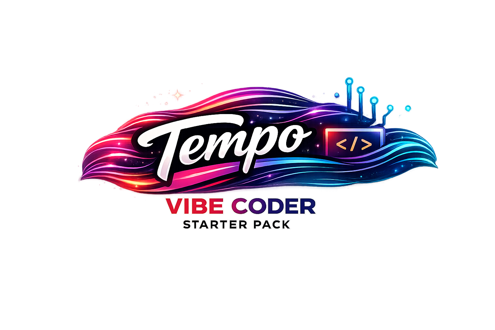

<p align="center">
  
</p>

# Tempo

### Build what you imagine — keep the rhythm.

**Tempo** is a vibe coding starter pack designed to help you turn imagination into working software — clearly, cleanly, and with momentum.

AI makes it possible to build from ideas alone. Tempo makes it sustainable.

This repo gives you:

- A clear structure from day one
- Guidance for AI agents to behave predictably
- Git workflows that turn history into progress
- A steady rhythm: plan → build → verify → commit → repeat

Tempo isn’t a framework. It’s a beat.

You describe what you want.  
Your AI helps you build it.  
Git keeps the story straight.

Whether you're a seasoned engineer or just curious about what you can create, Tempo helps you move fast without making a mess.

Clone it. Start building. Keep the rhythm.

## Agent First Command

```bash
codex "Please clone and use the tempo vibe coding starter pack via `git clone https://github.com/postworthy/tempo.git` and use it as the basis for my project."
```

## Alternative Method

```bash
git clone https://github.com/postworthy/tempo.git && cd tempo && codex "Use this repo as my starter pack. Read AGENTS.md and BOOTSTRAP.md, ask me the required intake questions, then draft PROJECT-BRIEF.md and SPEC.md for approval before coding."
```

If you are not using `codex`, replace `codex` with your assistant CLI (`claude`, `opencode`, etc.) and keep the same prompt text.
