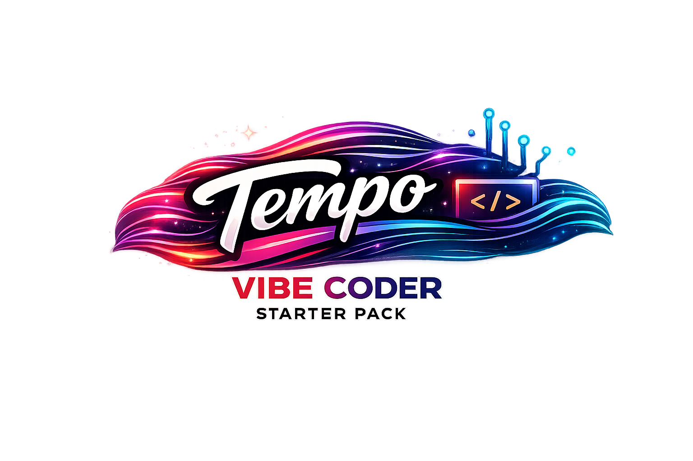

<p align="center">
  
</p>

# Tempo

### Build what you imagine — keep the rhythm.

**Tempo** is a vibe coding starter pack designed to help you turn imagination into working software — clearly, cleanly, and with momentum.

AI makes it possible to build from ideas alone. Tempo makes it sustainable.

This repo gives you:

- A clear structure from day one
- Guidance for AI agents to behave predictably
- Git workflows that turn history into progress
- A steady rhythm: plan → build → verify → commit → repeat

Tempo isn’t a framework. It’s a beat.

You describe what you want.  
Your AI helps you build it.  
Git keeps the story straight.

Whether you're a seasoned engineer or just curious about what you can create, Tempo helps you move fast without making a mess.

Clone it. Start building. Keep the rhythm.

## Setup

After cloning the repository to start a new project, run one command:

```bash
./bootstrap --init-project
```

It backs up Tempo's own development records, creates a clean project baseline,
installs the pinned dependencies, configures local safeguards, and runs
`pnpm verify`. Then tell your AI agent what you want to build and ask it to
follow `AGENTS.md`.

Tempo contributors can run plain `./bootstrap` to verify the repository without
resetting its project records.

To add only Tempo's portable governance, goals, and skills to an existing
repository, use the same command with a target and that repository's verification
command:

```bash
./bootstrap --mode adopt-existing --target /path/to/existing-repo --verify-command "make verify"
```

Target adoption does not install Node, pnpm, TypeScript, dependencies, or starter
application files.

Upgrading an older Tempo clone? Follow [MIGRATION.md](MIGRATION.md).

## Agent First Command

```bash
codex "Use the tempo vibe coding starter pack `git clone https://github.com/postworthy/tempo.git .` as the basis for my project. Start in discovery mode: help me brainstorm, ask clarifying questions, propose 2-3 v1 scope options with trade-offs, then draft PROJECT-BRIEF.md and SPEC.md for my approval before coding."
```

## Alternative Method

```bash
git clone https://github.com/postworthy/tempo.git && cd tempo && codex "Use this repo as my starter pack. Read AGENTS.md and BOOTSTRAP.md, ask me the required intake questions, then draft PROJECT-BRIEF.md and SPEC.md for approval before coding."
```

If you are not using `codex`, replace `codex` with your assistant CLI (`claude`, `opencode`, etc.) and keep the same prompt text.
